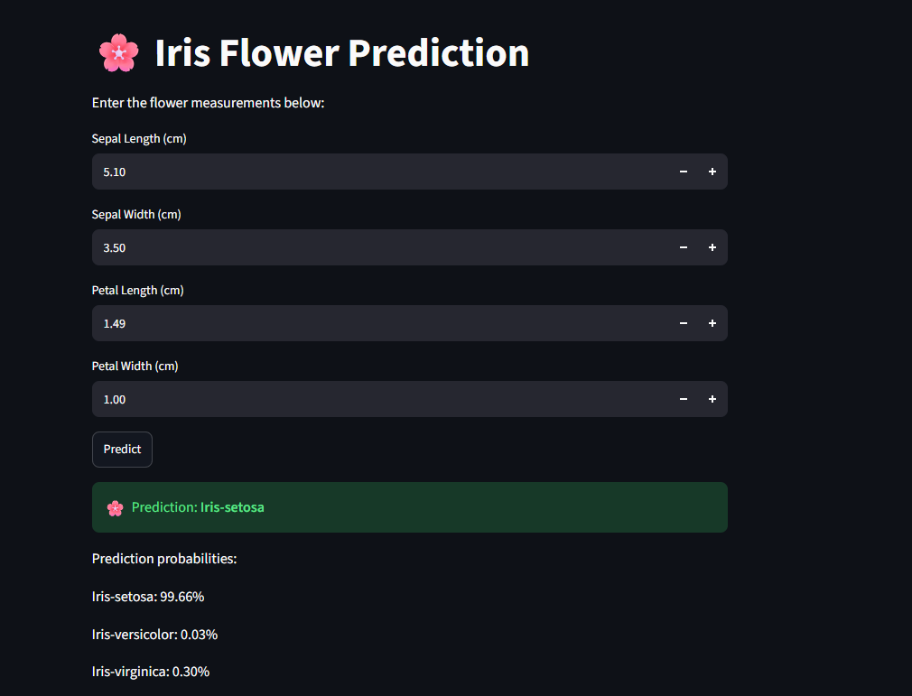

# 🌸 Iris Flower Prediction using Artificial Neural Network

A Deep Learning-based web application that predicts the species of an Iris flower using an Artificial Neural Network (ANN) built with TensorFlow/Keras and deployed using Streamlit Community Cloud.

---

## 🚀 Live Demo
🌸 **Try the application:**  
[https://connectwithaadi-iris-prediction.streamlit.app/](https://connectwithaadi-iris-prediction.streamlit.app/)

### 🖥️ Application Preview


---

## 📌 Project Overview
This project implements an Artificial Neural Network to classify Iris flowers into three different species based on their physical measurements.

The application takes four features as input:
- 🌱 **Sepal Length**
- 🌱 **Sepal Width**
- 🌸 **Petal Length**
- 🌸 **Petal Width**

The model predicts the flower species and displays the probability of each class.

---

## 🔄 Workflow

```text
Iris Dataset
     ↓
Data Preprocessing
     ↓
Label Encoding
     ↓
Feature Scaling
     ↓
ANN Model Training
     ↓
Model Evaluation
     ↓
Save Model (.h5)
     ↓
Save Scaler (.pkl)
     ↓
Streamlit Application
     ↓
Live Deployment
```

---

## 🧠 Artificial Neural Network
The model is built using TensorFlow/Keras.

### Architecture
```text
Input Layer
   │
   ├── 4 Input Features
   ↓
Dense Layer
   ├── 16 Neurons
   └── ReLU Activation
   ↓
Dense Layer
   ├── 8 Neurons
   └── ReLU Activation
   ↓
Output Layer
   ├── 3 Neurons
   └── Softmax Activation
```

### Model Configuration

| Parameter | Value |
| :--- | :--- |
| **Optimizer** | Adam |
| **Loss Function** | Categorical Crossentropy |
| **Metric** | Accuracy |
| **Epochs** | 100 |
| **Batch Size** | 8 |
| **Hidden Layers** | 2 |
| **Output Classes** | 3 |

---

## 📊 Model Performance
The trained ANN achieved approximately:

> **96.67% Test Accuracy** 🎯

The three classes predicted by the model are:
- `Iris-setosa`
- `Iris-versicolor`
- `Iris-virginica`

---

## 🛠️ Technologies Used
- **Language:** Python
- **Deep Learning / ML:** TensorFlow, Keras, Scikit-learn
- **Data Manipulation:** NumPy
- **Model Serialization:** Joblib
- **Web App Framework:** Streamlit
- **Development Environment:** Jupyter Notebook / Google Colab

---

## 📂 Project Structure

```text
Iris-Prediction-DL/
│
├── Iris.csv
├── Iris_prediction.ipynb
├── app.py
├── iris_model.h5
├── scaler.pkl
├── requirements.txt
├── README.md
└── .gitignore
```

### File Description

| File | Description |
| :--- | :--- |
| `Iris.csv` | Iris dataset |
| `Iris_prediction.ipynb` | Model training and evaluation notebook |
| `app.py` | Streamlit web application |
| `iris_model.h5` | Trained ANN model |
| `scaler.pkl` | Saved StandardScaler |
| `requirements.txt` | Python dependencies |
| `README.md` | Project documentation |

---

## ⚙️ Data Preprocessing
- The target labels are converted into numerical values using `LabelEncoder`.
- The input features are standardized using `StandardScaler` before being passed to the neural network.
- During prediction, the same fitted scaler is loaded from `scaler.pkl` so that new user inputs are transformed consistently with the training data.

---

## 🔮 Prediction Process
When a user enters flower measurements:

```text
User Input
    ↓
StandardScaler
    ↓
Trained ANN Model
    ↓
Softmax Prediction
    ↓
Class Probabilities
    ↓
Predicted Iris Species
```

### Example:
- **Sepal Length:** 5.10 cm  
- **Sepal Width:** 3.50 cm  
- **Petal Length:** 1.49 cm  
- **Petal Width:** 1.00 cm  

**Predicted Output:**
> 🌸 **Iris-setosa** (along with the class probabilities)

---

## 💻 Run the Project Locally

1. **Clone the repository:**
   ```bash
   git clone https://github.com/connectwithaadi/Iris-Prediction-DL.git
   ```

2. **Navigate to the project:**
   ```bash
   cd Iris-Prediction-DL
   ```

3. **Install dependencies:**
   ```bash
   pip install -r requirements.txt
   ```

4. **Run the Streamlit application:**
   ```bash
   streamlit run app.py
   ```

The application will open automatically in your browser.

---

## 📦 Requirements
The main dependencies are:
- `streamlit`
- `tensorflow`
- `scikit-learn`
- `joblib`
- `numpy`

---

## 🌐 Deployment
The application is deployed using Streamlit Community Cloud.

- **🚀 Live Application:** [https://connectwithaadi-iris-prediction.streamlit.app/](https://connectwithaadi-iris-prediction.streamlit.app/)

The deployed application provides an interactive interface where users can enter Iris flower measurements and instantly receive the predicted species along with prediction probabilities.

---

## 🎯 Key Features
- ✅ Artificial Neural Network-based classification
- ✅ Three-class Iris flower prediction
- ✅ Feature scaling using `StandardScaler`
- ✅ Probability-based predictions
- ✅ Interactive Streamlit interface
- ✅ Saved trained model (`.h5`)
- ✅ Saved preprocessing scaler (`.pkl`)
- ✅ Cloud deployment
- ✅ Simple and user-friendly UI

---

## 🔮 Future Improvements
- Add prediction history
- Add data visualizations
- Add confusion matrix visualization
- Compare ANN with traditional ML models
- Improve UI/UX
- Add model performance charts
- Add additional classification datasets

---

## 👨‍💻 Author
**Aditya Kumar Singh**
